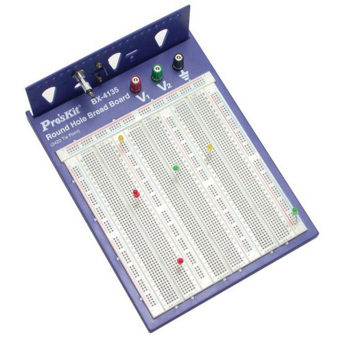

JS Breadboard Emulator
==

Goals
--

1. Make modeling circuits we build in class easier
2. Easy to use
	- drag and drop 7400 chips onto breadboard
	- drag and drop same wires used in class onto breadboard
3. Follows logic rules and outputs correct outputs
	- Current flows through circuit and comes out at outputs correctly
4. Create an extensible way of adding new chips and logic as we go through class
	- Chips inherit from a master chip object and simply modify the pins used and the logic function 
5. Looks cool

Information
--
- http://www.proskit.com/prototyping/electronics/round-hole-breadboard-2420-tie-points
- 

Objects
--
- Breadboard
	- Properties
		- has two extra bus strips
			- one combo on x axis and one on y axis
		- has 3 blocks
			- has one vcc bus strip
			- has one vg bus strip
			- has 64 terminal strips
				- odd numbered strips are on edge closer to bus
	- Strips
		- Properties
			- has n pins
			- when one is connected to a value, the others become that value
		- Types
			- Terminal Strip
				- 5 pins
				- has number ID
			- Bus strip
				- has 20 pins
				- can be ground or vcc
				- assumed to already have an in pin defined, at the very beginning of the row
				- UI display these connected pins as connected
	- Pins
		- can be referenced by terminalID and rowID
- 7400 Chip
	- 
- Wire
- LEDs
	- has ideal resistance
	- has color
	- has two inputs
		- short
		- tall
- General Object
- Resistor

Milestones
--
- Two strips
	- 
- Basic chip 1 - NOT
- LED
- Determine plan of action for representing objects
- Build one block
- Build all blocks and extra bus strips
- More chips
	- AND
	- NAND
	- NOR
	- OR
- Create pretty UI
- Decide if going the analog route with useful resistors
- Left half of breadboard
- Right half of breadboard
- (Resistor)
- More chips

Questions
--
- Should there be multiple types of resistors?
- Should the circuit follow act as if its digital or as if its analog?
	- added complexity if analog - is the voltage in the range to be on?
	- if analog, easier to make resistors actually do something (which they will probably be needed for later on in the class), otherwise resistors will be nothing more than something paired with an LED
- What happens if you send ground and vcc into one terminal strip?
- Will the circuit recognize v1 and v2? (only necessary if it respects differences in voltage, e..g 5v vs 12v)